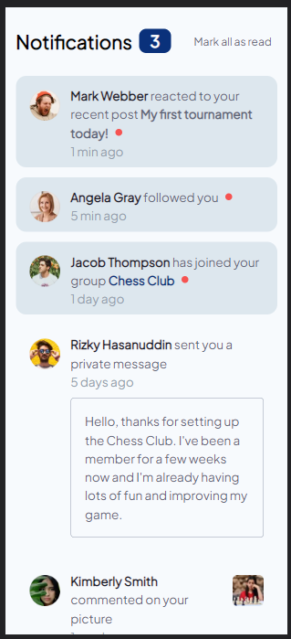
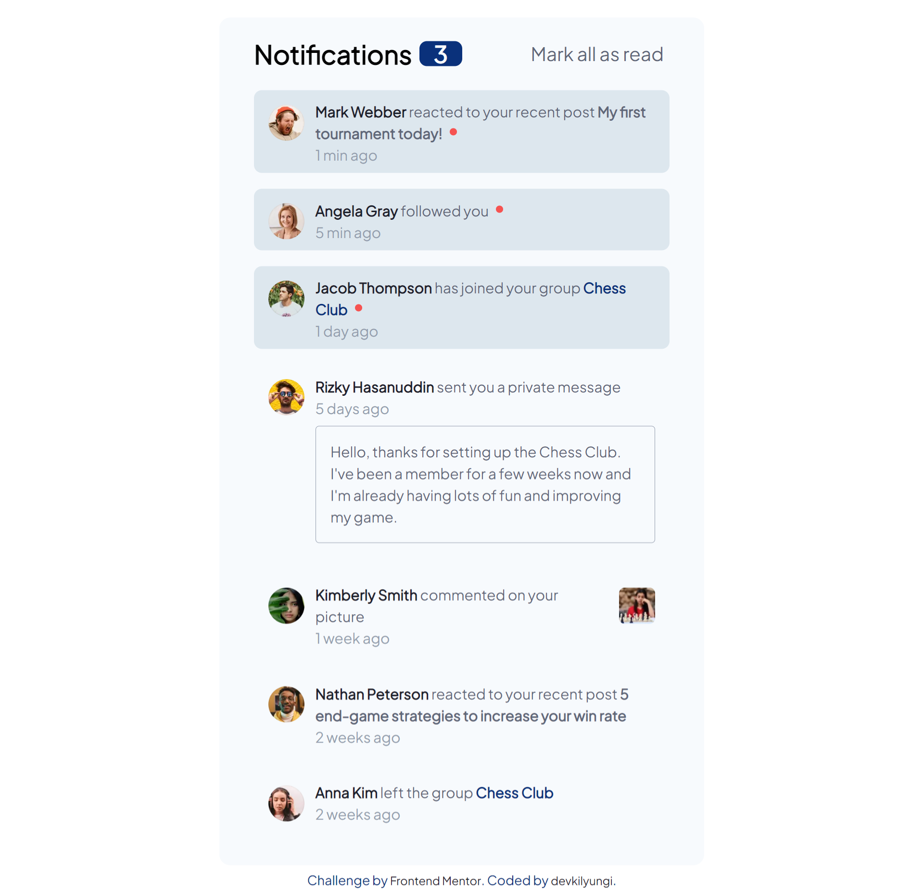

# Frontend Mentor - Notifications page solution

This is a solution to the [Notifications page challenge on Frontend Mentor](https://www.frontendmentor.io/challenges/notifications-page-DqK5QAmKbC). Frontend Mentor challenges help you improve your coding skills by building realistic projects.

## Table of contents

- [Overview](#overview)
  - [The challenge](#the-challenge)
  - [Screenshot](#screenshot)
  - [Links](#links)
- [My process](#my-process)
  - [Built with](#built-with)
  - [What I learned](#what-i-learned)
  - [Continued development](#continued-development)
  - [Useful resources](#useful-resources)
- [Author](#author)

## Overview

### The challenge

Users should be able to:

- Distinguish between "unread" and "read" notifications
- Select "Mark all as read" to toggle the visual state of the unread notifications and set the number of unread messages to zero
- View the optimal layout for the interface depending on their device's screen size
- See hover and focus states for all interactive elements on the page

### Screenshot

Mobile view

Desktop view

### Links

- Live Site URL: [Github page](https://devkilyungi.github.io/notifications-page/)

## My process

- I first built the mobile design, then optimised for smaller devices.
- I then added resposiveness for larger screen devices.
- Finally I added hover states and the ability to clear unread messages using JavaScript.

### Built with

- Semantic HTML5 markup
- CSS custom properties
- Flexbox
- Mobile first approach

### What I learned

- How to set up and use variable fonts.
- Good breakpoints to use in order to have a site responsive for most, if not all, screen sizes.

### Continued development

- More experimentation with variable fonts.
- Complex projects that use more JavaScript.

### Useful resources

- [Get started with variable fonts in CSS](https://www.creativebloq.com/features/get-started-with-variable-fonts-in-css) - This helped me quickly get started with variable fonts. It explains the concept easily and has good examples of use cases.

## Author

- Frontend Mentor - [@devkilyungi](https://www.frontendmentor.io/profile/devkilyungi)
- Twitter - [@vkilyungi](https://www.twitter.com/vkilyungi)
